# 2025-topic-03-group-04

# 🧬 Proteome-wide Screen for RNA-dependent Proteins

Welcome to the **Proteome-wide Screen for RNA-dependent Proteins** project! This repository will serve as the central place for exploring, analyzing, and visualizing data related to RNA-protein interactions across the proteome.

> ⚠️ *Note: This README is a starting template. Please update it as your project evolves.*
>
> For inspiration on writing a comprehensive and engaging README, check out the [Awesome README](https://github.com/matiassingers/awesome-readme?tab=readme-ov-file) repository.

# 📚 Papers

# Reviews

-   [Sternburg et al., Global Approaches in Studying RNA-Binding Protein Interaction Networks, 2020, Trends in Biochemical Sciences.pdf](https://github.com/user-attachments/files/19981693/Sternburg.et.al.Global.Approaches.in.Studying.RNA-Binding.Protein.Interaction.Networks.2020.Trends.in.Biochemical.Sciences.pdf)
-   [Corley et al., How RNA-Binding Proteins Interact with RNA Molecules and Mechanisms, 2020, Molecular Cell.pdf](https://github.com/user-attachments/files/19981705/Corley.et.al.How.RNA-Binding.Proteins.Interact.with.RNA.Molecules.and.Mechanisms.2020.Molecular.Cell.pdf)
-   [Gebauer et al., RNA-binding proteins in human genetic disease, 2020, Nature Reviews Genetics.pdf](https://github.com/user-attachments/files/19981707/Gebauer.et.al.RNA-binding.proteins.in.human.genetic.disease.2020.Nature.Reviews.Genetics.pdf)

# Experimental methods

-   [Caudron-Herger et al., R-DeeP Proteome-wide and Quantitative Identification of RNA-Dependent Proteins by Density Gradient Ultracentrifugation, 2019, Molecular Cell.pdf](https://github.com/user-attachments/files/19981712/Caudron-Herger.et.al.R-DeeP.Proteome-wide.and.Quantitative.Identification.of.RNA-Dependent.Proteins.by.Density.Gradient.Ultracentrifugation.2019.Molecular.Cell.pdf)
-   [Caudron-Herger-Identification, quantification and bioinformatic analysis of RNA-dependent proteins by RNase treatment and density gradient ultracentrifugation using R-DeeP-2020-Nature Protocols_1.pdf](https://github.com/user-attachments/files/19981715/Caudron-Herger-Identification.quantification.and.bioinformatic.analysis.of.RNA-dependent.proteins.by.RNase.treatment.and.density.gradient.ultracentrifugation.using.R-DeeP-2020-Nature.Protocols_1.pdf)
-   [Rajagopal-Proteome-Wide Identification of RNA-Dependent Proteins in Lung Cancer Cells-2022-Cancers.pdf](https://github.com/user-attachments/files/19981723/Rajagopal-Proteome-Wide.Identification.of.RNA-Dependent.Proteins.in.Lung.Cancer.Cells-2022-Cancers.pdf)
-   [Rajagopal et al., An atlas of RNA-dependent proteins in cell division reveals the riboregulation of mitotic protein-protein interactions. Nat. Commun. 16, 2325 (2025).pdf](https://github.com/user-attachments/files/19981728/Rajagopal.et.al.An.atlas.of.RNA-dependent.proteins.in.cell.division.reveals.the.riboregulation.of.mitotic.protein-protein.interactions.Nat.Commun.16.2325.2025.pdf)

Link Poster: <https://1drv.ms/p/c/337a8934cc5b3155/ETyOdkKQGRpCqyr-7-2QN2QBiw53JFm50umwSPKrppZBrg?e=mEley3>

\# **Group 4 Data Analysis Projekt**

# Compatibility test: From 0 - 1, how interacting are you?​

## Protein features as predictors of RNA interactions

RNA–protein complexes are key regulators of numerous cellular processes. In recent years, proteome-wide experimental and computational approaches to study RNA-binding proteins (RBPs) have gained increasing scientific relevance and attention. Recent research has revealed a link between dysfunctional RBPs and the development of various types of cancer. These findings now open the door to a previously underexplored area: RNA-dependent proteins — a class of proteins whose protein–protein interactome is modulated by RNA.

Exploratory question: Predictive Potential – Do Isoelectric Point and Mass Indicate Shifting Behavior?

## **🎯 Project Objective**

The aim of this project is the automated identification of RNA-dependent proteins in a non-synchronized A549 cell line, which originates from a lung adenocarcinoma. To achieve this, we investigate the influence of RNA on protein complexes by comparing protein distribution profiles between untreated cell lysates (control samples) and RNase-treated lysates (RNase samples)

## **🧪 Experimental Design**

-   Lysates are fractionated via ultracentrifugation through a sucrose density gradient, resulting in 25 fractions per sample.
-   Proteins in each fraction are quantified proteome-wide using mass spectrometry, with three replicates per condition.
-   The final dataset consists of 3,680 proteins across 150 fractions (3,680 × 150 data points)

## **📊 Data Analysis**

-   Changes in density distribution profiles (shifts) between control and RNase-treated samples are analyzed.
-   These shifts form the basis for the classification of proteins based on RNA-dependence.
-   The developed tool enables automated analysis of large-scale datasets to detect RNA-modulated proteins using experimentally measurable features. 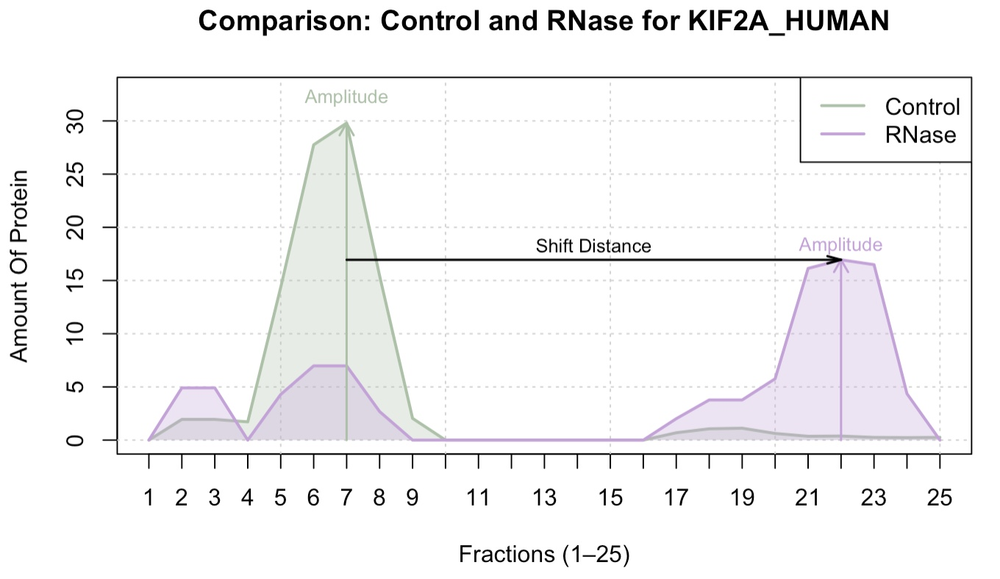

# **🔮Project Overview**

## Table Of Contents

-   [I. Data Exploration](#data-exploration)
-   [II. Data Normalization](#data-normalisation)
    -   [Normalisation](#normalisation)
    -   [Batch Removal](#batch-removal)
-   [III. Shift Analysis](#shift-analysis)
    -   [Tests](#tests)
    -   [Logistic Model](#logistisches-model)
-   [IV. Linear Regression](#linear-regression)
-   [V. Dimension Reduction](#dimension-reduction)
    -   [PCA](#pca)
    -   [k-means](#k--means)
    -   [Chi Squared test](#chi-squared-test)

# **I. Data Exploration** {#data-exploration}

-   Examine the dimensions of our dataset and potential inconsistencies in the produced data. Also, investigate whether the experimental nature of the measurements is reproducible, and therefore applicable to our analysis. Large scale measurements carry the risk of introducing potential technical variability. By calculating the correlation between all replicates across the fractions for each treatment we can confirm the reliability and stability of the measurements.

**1. Dataset Description**

The dataset contains all the concentrations detected with massspectrometry for 3680 proteins. It contains 150 columns, made up from the 2 treatments with each three replicates per fraction. The initial measurement did not contain any NAs.

.jpeg)

**2. Evaluate Reproducibility**

The method used was the spearman correlation due to the sensitivity of the comparing values.

**Output**:

By receiving correlation values higher than 0.9, the control values showed very high correlation and are therefore reproducible. Our rnase measurements correlated less, especially in fractions 2, 21 and 23. We defined a threshold of reproducibility at 0.7, which the measurements of fraction 2 did not surpass. Nevertheless since the majority of the values are still highly correlating, we accept the sporadic variance in the second measurement in application to our analysis, however, we cannot conclude reproducibility for other measurements.  

# **🧼 II. Data Normalisation** {#data-normalisation}

-   Ensure comparability and interpretability of protein intensity profiles across replicates and conditions (Control vs. RNase) by normalising and transforming the values with following steps:
-   During data normalisation three main steps are executed. By pairwise normalising and smoothing the data comparability is established. Transformation and normalisation aligns the value ranges. Due to batch effect correction the systematic bias is removed.\

## **📃Steps:**

### **📊Normalisation** {#normalisation}

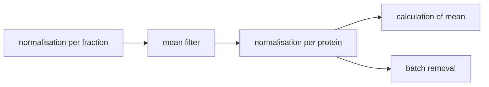

1.  **Step 1: Normalisation per Replicate and Fraction**\
    For each fraction, three replicates are normalized by calculating the mean of the two most similar replicates (out of three) as a reference value.\
    Each replicate is then scaled relative to this reference, adjusting differences based on pairwise similarity.\
    → This pairwise normalization is both fraction- and replicate-specific.

    **Output:**\
    Two data frames (Control and RNase), each containing 75 columns (3 replicates × 25 fractions) with scaled protein intensities.\
    **Normed Control Dataframe (first 6 rows)**\
    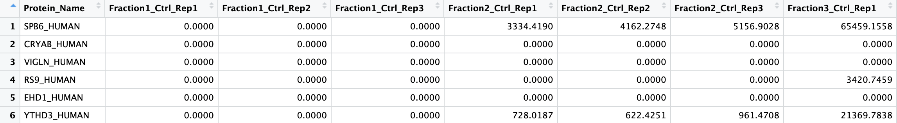

    **Normed RNase Dataframe (first 6 rows)**\
    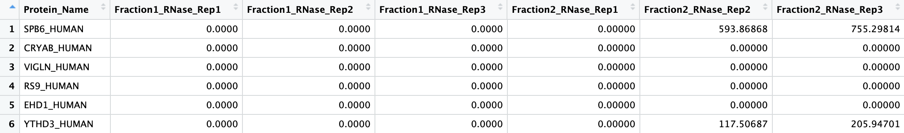

2.  **Step 2: Smoothing via Moving Average**\
    To reduce local fluctuations, a moving average is applied to each replicate of each protein across the 25 fractions.\
    For each center fraction (except the first and last), the mean of its value and its two neighbors (left and right) is computed.\
    → Smoothing is done separately per protein and replicate.\
    → The first and last fractions remain unchanged to preserve boundaries.

3.  **Step 3: Normalisation Across Replicates and Fractions**

    **3.1 Normalize Replicates:**\
    Each replicate (per protein) is scaled such that the total intensity across all 25 fractions sums to 100%. This ensures comparability across replicates.

    **3.2 Average Across Replicates:**\
    For each fraction, the mean intensity across the three normalized replicates is computed, resulting in a single distribution per protein.

    **3.3 Normalize Averaged Profile:**\
    The resulting profile (mean per fraction) is again scaled so that the sum across all 25 fractions equals 100%. This ensures the averaged profiles remain on a comparable scale.

    **Output:**\
    Two final data frames (Control and RNase), each containing 25 columns (fractions) with normalized, comparable protein distributions.

    **Normalized Control Dataframe (first 6 rows)**\
    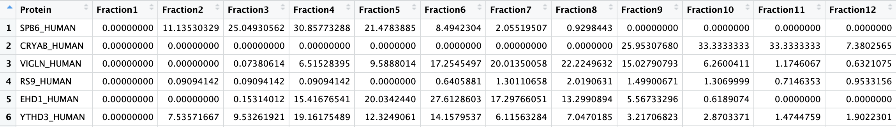

    **Normalized RNase Dataframe (first 6 rows)**\
    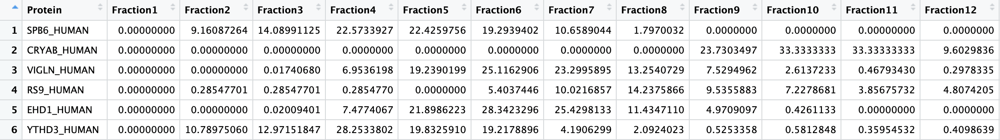

### **💥Batch Removal** {#batch-removal}

**Batch effect:** Disturbances are rooted in technical variances, such as different runs, and not in biological variations.\
They can influence further observations, analysis, and interpretation\
→ Comparisons between replicates to establish proper identification

1.  Identifying and deleting with **limma package**\
    → removes known batch effects with **removeBatchEffect**

    → Steps:

    1.  **log2 - transformation:**\
        → stabilizes variance, improves interpretability, reduces outlier effects\
    2.  **apply function**

    **PCA visualization**\
    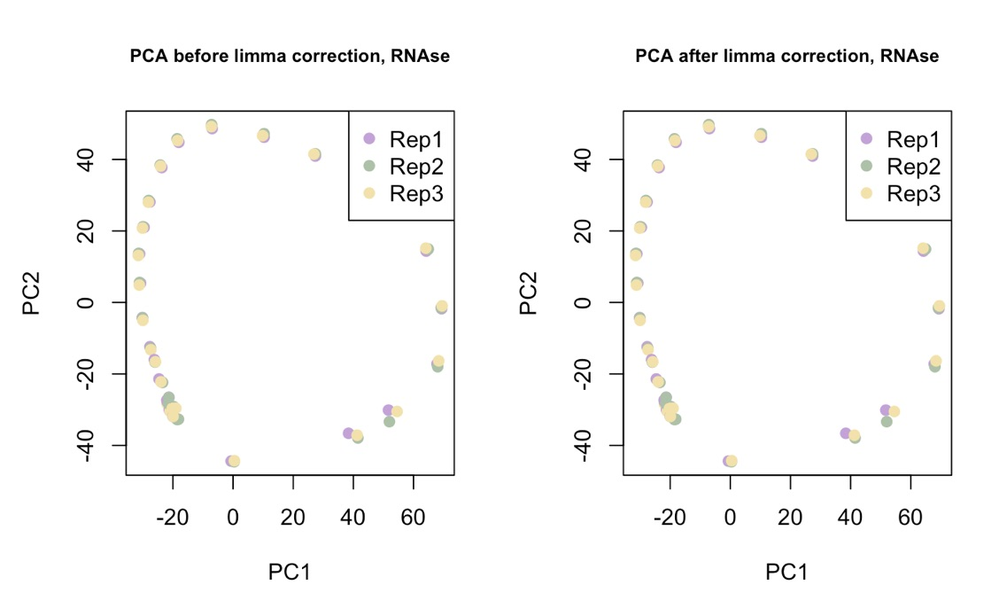

    **Output**\
    There is no severe change visible, the data before is rather spread out but the batches themselves do not cluster extremely.

2.  Identifying and deleting with **SVA**\
    → Surrogate Variable Analysis\
    → better for unknown batch effect and other disturbances

    -   Steps:

        1.  **Model preparations**\
            → create a design matrix with a model matrix filled with known factors (replicates and fractions) and a null model matrix filled with no descriptive factors but an intercept\
        2.  **Apply SVA**\
            → Apply function on data and models\
        3.  **Determine the number of surrogate variables**\
            → SVA estimates how many Svs are needed to model hidden batch effects\
            → by searching for combinations not explainable by known variables\
            → extend the matrix by SVs\
        4.  **Data correction**\
            → using linear regression\
            → SVs are used to calculate unwanted effects and remove those\
        5.  **Residues extraction**\
            → expression data - modeled effects (fraction + replicates + SVs )\

        6.Visualizations

    **PCA visualization**\
    

    **Output**\
    With SVA there is a batch effect visible. It is shown in the circular structure beforehand which does not directly hint at a batch effect between replicates but other more hidden possible effects. Afterwards the point are more centered and there is no structure visible, overall they seem more homogeneous .

3.  **Interpretation and results:**\
    → SVA better fit due to unknown batch effects ( not known when measurements are taken, or on which machines)\
    → Log2 transformation makes the data less suitable for further analysis → Batch effect not overly significant\
    → Removal still could overcorrect biological variances

# **✅ III. Shift Analysis** {#shift-analysis}

## ️**📃Steps**

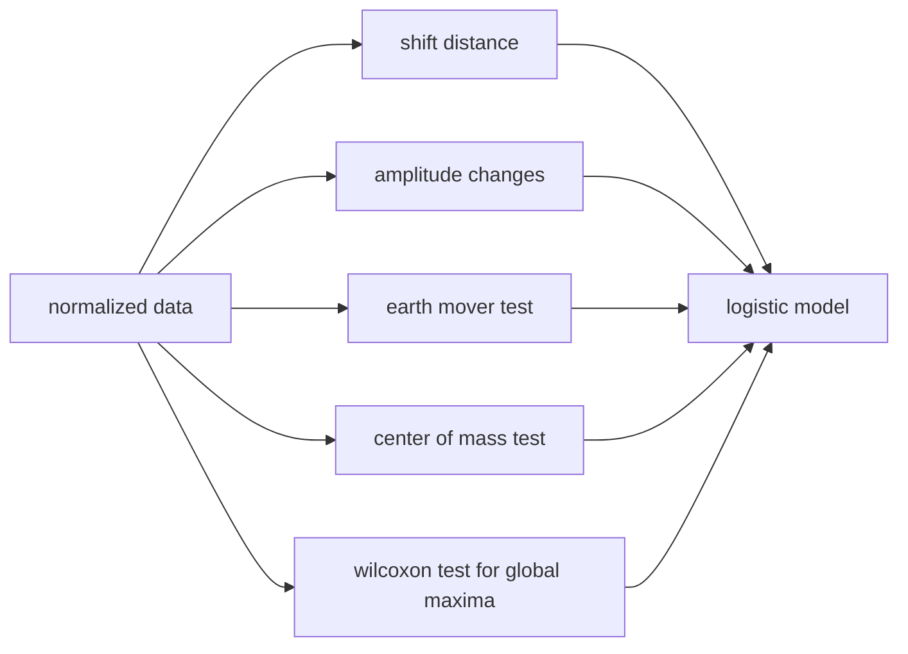

### **📝Tests** {#tests}

-   **Shift Distance:** By subtracting the position of the global maximum from the control sample from the position of the RNase maximum we can calculate the migration of the major protein components. Due to the distribution in the saccharose gradient that distance gives us an estimate of the change caused to the protein assembly after RNase treatment.

    **Output:** The bigger the shift distance the higher the impact of RNase on the characteristics of the protein.

-   **Amplitude Changes:** The amplitude of the global maximum is determined in order to uncover a possible change in the protein content given in the fraction, as well as protein-complex assembly after RNase treatment

    **Output:** A significant change between the amplitudes indicates a strong effect of RNase on the protein content per fraction.

-   **Earth Mover Test (EMD):** The Earth Mover’s Distance (EMD) measures **how much "work" is needed to transform one distribution into another**. In this context, it reflects how much protein (mass) must be shifted and how far to make the ctrl distribution resemble the rnase distribution.

    **Output:**\
    In 1D, EMD is calculated as the sum of absolute differences between the empirical cumulative distribution functions (ECDFs) of the two conditions. **Higher EMD indicates greater differences in distribution shape.**

-   **Center Of Mass Test (COM):**\
    COM calculates the intensity-weighted average position of a protein’s distribution.

    Delta-COM compares this position between two treatments Control and RNase.

    **Output:**\
    A higher absolute Delta-COM indicates a stronger shift, with the sign showing shift direction (positive = right shift).

-   **Wilcoxon Statistic:** The Wilcoxon signed-rank test (specifically the paired version) is a non-parametric statistical method used to compare two related samples. In this context, it is used to assess whether the global maximum of the same protein differs between two treatments (Control an RNase), using matched replicates.

    **Output:**\
    **The p-value indicates how likely the observed shift of the global maxima occurred by chance.** A small p-value (e.g., \< 0.05) suggests that the shift is statistically significant.\

    The test statistic W measures how consistently one condition tends to produce higher or lower values than the other.

    -   A small W value suggests that most differences go in the same direction (e.g., treatment Control is almost always higher than RNase), which indicates a significant difference

### **🤖Logistic Model**

A logistic regression model is trained using reference proteins to predict the probability of RNA-binding for other proteins from our dataset.

### Comparison of Positive and Negative Controls

-   Proteins are assigned as positive or negative controls based on how frequently they have been previously reported as RNA-binding proteins (RBPs)

-   A 30/70 split is used to establish the logistic regression model - meaning 30 % of the proteins in the dataset are used to train the logistc model

-   It is crucial that positive and negative control groups differ significantly to enable meaningful model discrimination.

-   A Mann–Whitney U test (Wilcoxon rank-sum test) is applied on the testscores of the referene proteins to verify differences between control groups.

### Model Construction

1.  **Fit logistic regression:**\
    The logistic model was trained on reference proteins assigned as positive or negative controls. The input features — EMD, shift distance, amplitude changes, center of mass, and the Wilcoxon statistic — reflect the outcomes of computational tests performed on these proteins, capturing their RNA-binding behavior.

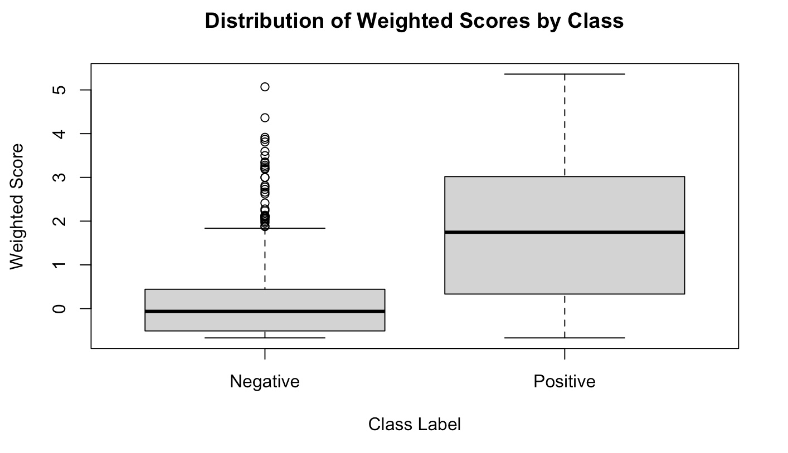

        During training, the model estimates a regression coefficient for each test-derived feature\
        in order to maximize the discrimination between the positive and negative control groups.

2.  **Regression Coefficients:**\
    The results indicate that all predictors - meaning test-derived features - significantly affect RNA-binding classification. The regression coefficients reflect the strength and direction with which each predictor influences the log-odds of a protein being RNA-binding.

    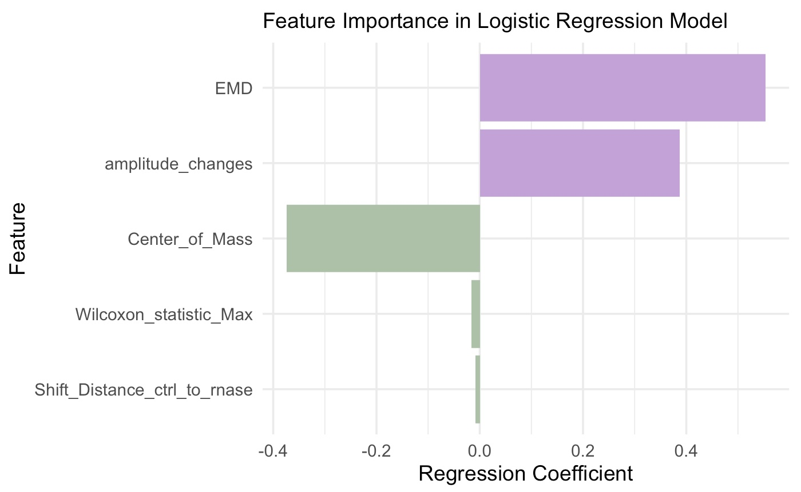

    -   positive coefficients (purple bars) indicate features that increase the probability of RNA-binding
    -   negative coefficients (green bars) indicate features that decrease the probability of RNA-binding\
        -\>EMD has the strongest influence on the probability of RNA-binding

3.  **Model output:**\
    The trained model was applied to the remaining 70% of proteins, yielding RNA-binding probability scores for each case. To classify proteins as RBPs or non-RBPs based on their predicted scores, a threshold corresponding to a false discovery rate (FDR) of 10% was applied.

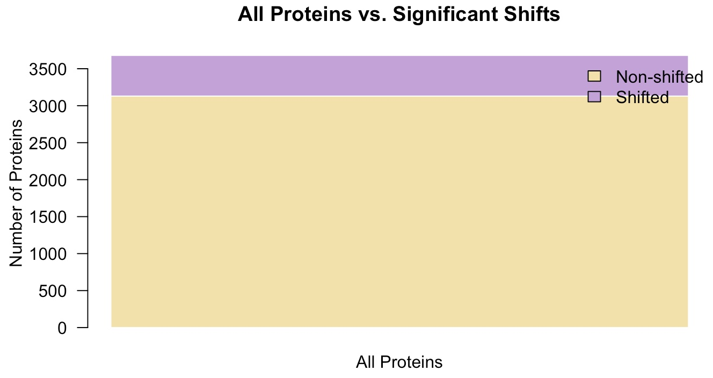 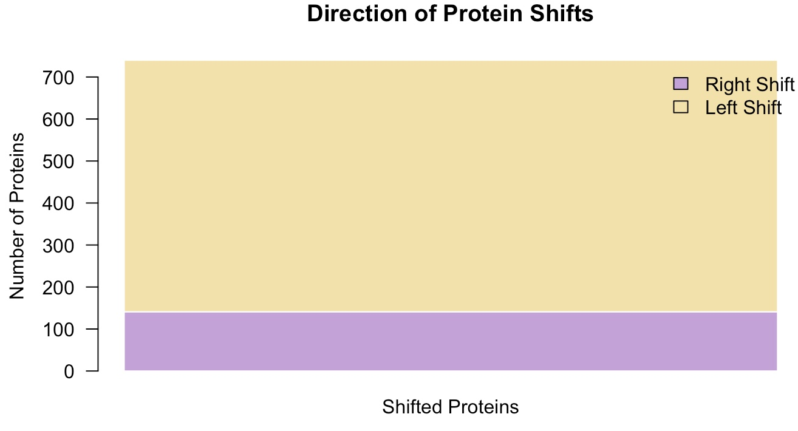 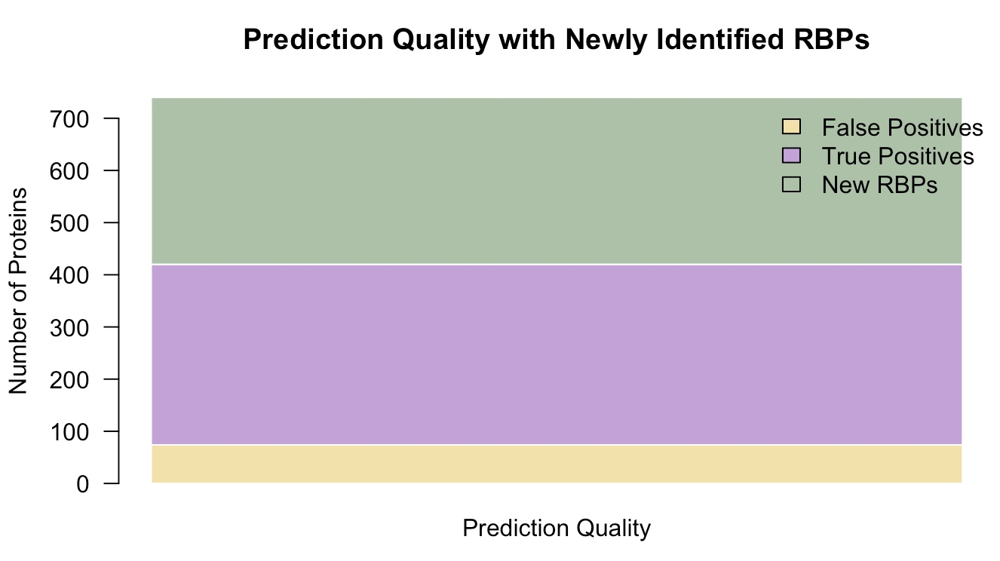

       Altogether, 740 proteins were classified as RNA-binding, of which 141 exhibited a right shift.\
       Excluding the proteins used for model training, 320 novel RBPs were identified.

4.  **Accuracy of Model:**\
    visualise the predictive accuracy of our logistic regression model

    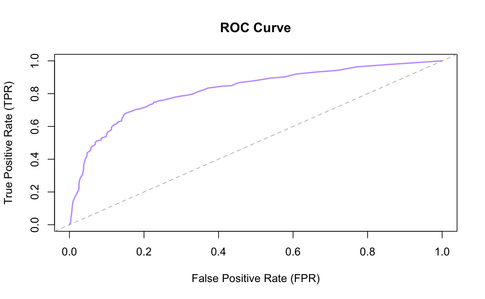

    -\> the predictive accuracy lies way above the "coincidence line"\

# **📈 IV. Linear Regression** {#linear-regression}

-   Investigate the influence of selected predictors (molecular weight and isoelectric point) on the probability of RNA dependence and assess their statistical significance
-   for new data: predict RNA dependence based on experimentally accessible features

## **📃Steps**

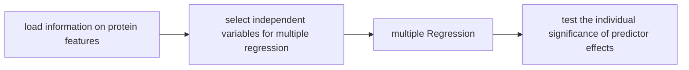

1.  **select independent variables for multiple regression**:\
    Independent variables should exhibit minimal correlation to avoid multicollinearity\
    Therefore, the correlation between molecular weight, sequence length, and isoelectric point was examined\
    A strong correlation was observed between molecular weight and sequence length\
    Since molecular weight is more readily accessible experimentally than sequence length, it was used as a predictor in the multiple regression model along with the isoelectric point (pI).

2.  **multiple regression**:\
    The multiple regression analysis shows that both the isoelectric point (pI) and molecular weight (Mass_kDa) are significantly associated with the target variable (p \< 0.001). The pI has the stronger effect (t = 21.12), followed by molecular weight (t = 3.38) 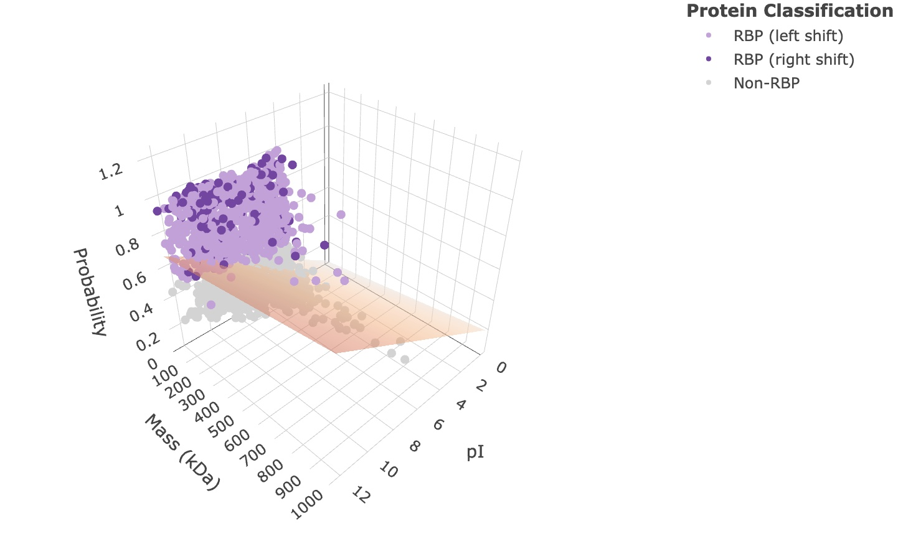\
    This 3D scatterplot displays the actual data points alongside the regression plane determined by the multiple regression analysis.\
    The closer the points lie to the plane, the better the model fits the observed data. Large distances between the points and the plane indicate that the model explains only a small portion of the variance.\
    Specifically, the model explains approximately 10.8% of the variance (adjusted R² = 0.108).

3.  **test the individual significance of predictor effects**:\
    t-tests were conducted to determine whether RBPs and non-RBPs differ significantly in their isoelectric point (pI) and molecular weight\
    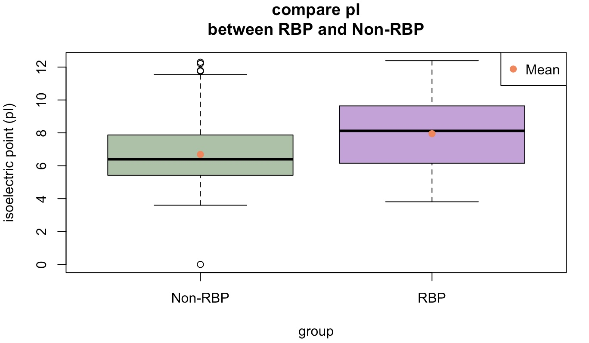\
    A significant association was found between higher isoelectric point (pI) and increased probability of RNA dependence.\
    On its own, mass is not a significant predictor of RNA-binding behavior. Mass becomes a significant predictor only when pI is accounted for, as demonstrated by the multiple regression analysis.

# **V. Dimension reduction** {#dimension-reduction}

## **🎯Objective:**

-   Reduce dimension for better exploratory analysis
-   Cluster results to find underlying relations

## **📃Steps**

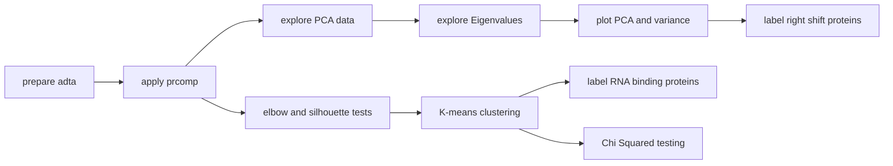

### **Principal component analysis** {#pca}

To reduce dimensions, the **prcomp** command is used.

As it uses singular value decomposition, it has a slightly better numerical accuracy according to R.

**Eigenvalues** Eigenvalues reflect the total amount of variance explained by each principal component. They are stored in the **rotation** factor. By squaring the standard deviation, the variance is calculated. Variance can then be used to calculate the percentage explained by each principal component.

All data sets on which PCA was performed on, covered roughly 65 % of variance with their first two PCs.

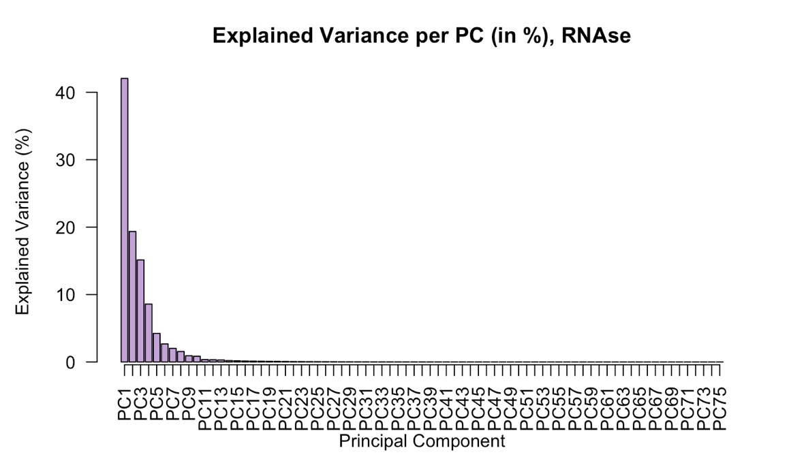

### **K-Means Clustering** {#k-means}

The ideal **Amount of clusters** is determined first with an **elbow plot**. The graph gives a suggestion of how many clusters should be used. For a more detailed determination the **silhouette scores** are calculated and plotted.

**K-means** is applied and plotted according to the previous results.

In the K-means plots **RNA binding proteins** are labeled in order to determine a biological correlation between RBPs and the resulting clusters.

|                               |                              |
|-------------------------------|------------------------------|
| 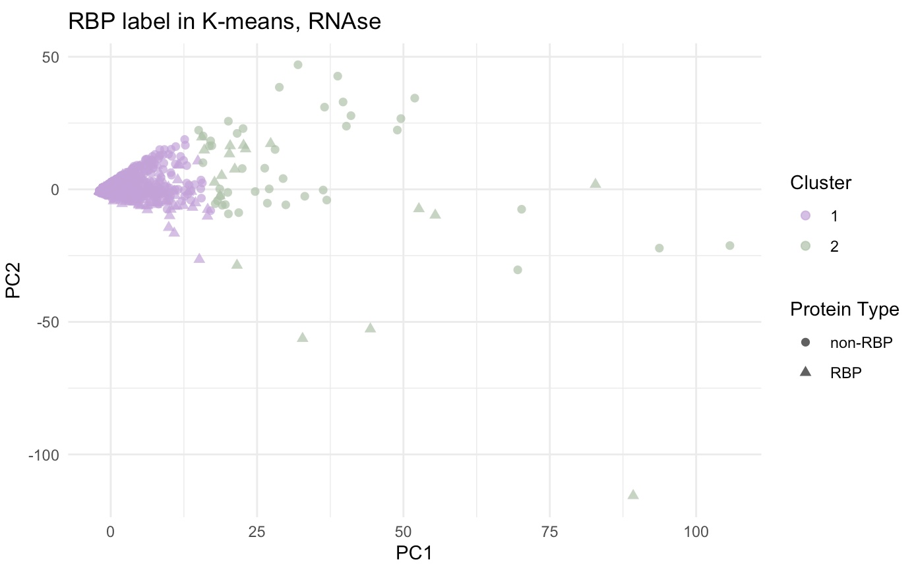 | 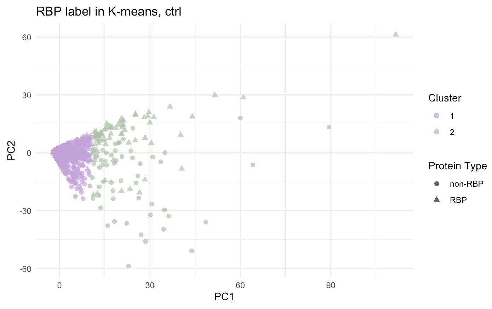 |

### **Chi Squared test** {#chi-square}

In order to check for a significant association between clusters and RBPs.\
The data is turned into a contingency table and the test executed.

**Output:** For Ctrl we could determine a significant p-value. This indicates there is a relation between clusters and RNA binding proteins.
