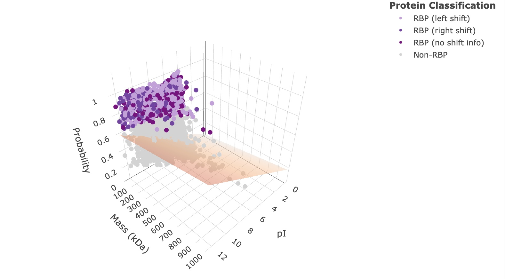
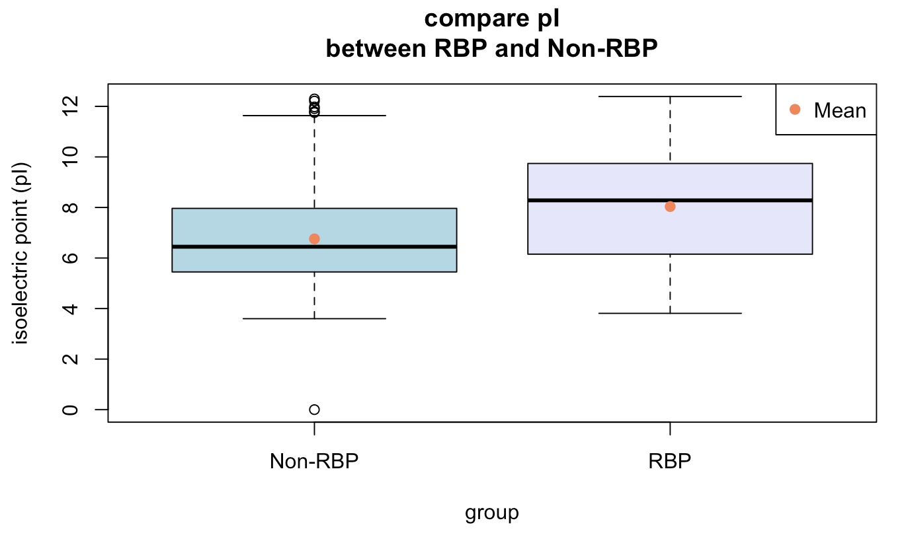

# 2025-topic-03-group-04

# 🧬 Proteome-wide Screen for RNA-dependent Proteins

Welcome to the **Proteome-wide Screen for RNA-dependent Proteins** project! This repository will
serve as the central place for exploring, analyzing, and visualizing data related to RNA-protein
interactions across the proteome.

> ⚠️ *Note: This README is a starting template. Please update it as your project evolves.*
>
> For inspiration on writing a comprehensive and engaging README, check out the [Awesome
> README](https://github.com/matiassingers/awesome-readme?tab=readme-ov-file) repository.

# 📚 Papers

# Reviews

-   [Sternburg et al., Global Approaches in Studying RNA-Binding Protein Interaction Networks, 2020,
    Trends in Biochemical
    Sciences.pdf](https://github.com/user-attachments/files/19981693/Sternburg.et.al.Global.Approaches.in.Studying.RNA-Binding.Protein.Interaction.Networks.2020.Trends.in.Biochemical.Sciences.pdf)
-   [Corley et al., How RNA-Binding Proteins Interact with RNA Molecules and Mechanisms, 2020,
    Molecular
    Cell.pdf](https://github.com/user-attachments/files/19981705/Corley.et.al.How.RNA-Binding.Proteins.Interact.with.RNA.Molecules.and.Mechanisms.2020.Molecular.Cell.pdf)
-   [Gebauer et al., RNA-binding proteins in human genetic disease, 2020, Nature Reviews
    Genetics.pdf](https://github.com/user-attachments/files/19981707/Gebauer.et.al.RNA-binding.proteins.in.human.genetic.disease.2020.Nature.Reviews.Genetics.pdf)

# Experimental methods

-   [Caudron-Herger et al., R-DeeP Proteome-wide and Quantitative Identification of RNA-Dependent
    Proteins by Density Gradient Ultracentrifugation, 2019, Molecular
    Cell.pdf](https://github.com/user-attachments/files/19981712/Caudron-Herger.et.al.R-DeeP.Proteome-wide.and.Quantitative.Identification.of.RNA-Dependent.Proteins.by.Density.Gradient.Ultracentrifugation.2019.Molecular.Cell.pdf)
-   [Caudron-Herger-Identification, quantification and bioinformatic analysis of RNA-dependent
    proteins by RNase treatment and density gradient ultracentrifugation using R-DeeP-2020-Nature
    Protocols_1.pdf](https://github.com/user-attachments/files/19981715/Caudron-Herger-Identification.quantification.and.bioinformatic.analysis.of.RNA-dependent.proteins.by.RNase.treatment.and.density.gradient.ultracentrifugation.using.R-DeeP-2020-Nature.Protocols_1.pdf)
-   [Rajagopal-Proteome-Wide Identification of RNA-Dependent Proteins in Lung Cancer
    Cells-2022-Cancers.pdf](https://github.com/user-attachments/files/19981723/Rajagopal-Proteome-Wide.Identification.of.RNA-Dependent.Proteins.in.Lung.Cancer.Cells-2022-Cancers.pdf)
-   [Rajagopal et al., An atlas of RNA-dependent proteins in cell division reveals the
    riboregulation of mitotic protein-protein interactions. Nat. Commun. 16, 2325
    (2025).pdf](https://github.com/user-attachments/files/19981728/Rajagopal.et.al.An.atlas.of.RNA-dependent.proteins.in.cell.division.reveals.the.riboregulation.of.mitotic.protein-protein.interactions.Nat.Commun.16.2325.2025.pdf)

# **Group 4 Data Analysis Projekt**

# Stille Signale: Proteinmerkmale als Prädiktoren für RNA-Interaktionen (Vorschlag von Jetty)

# **Projekt Überblick**

## **Ziel:**

## **Libraries:**

## **Daten laden**

# **Daten Aufreinigung**

## **Ziel:**

# **Daten Beschreibung (Data Description)**

## **Ziel:**

# **Daten Normalisierung**

## **Ziel:**

-   Vergleichbarkeit herstellen:
    -   Methoden???
-   Verzerrungen entfernen:
    -   Batch-Effekt entfernen
-   Zahlenbereiche angleichen:
    -   Skalierung und Normierung
    -   Transformation

## **Ablauf:**

1.  **3 Replikate pro Fraktion werden normalisiert**:\
    Unterschiede zwischen den Replikaten werden basierend auf dem\
    ähnlichsten Replikatpaar (Normalisierungsfaktor) ausgeglichen\
    =\> Fraktions- und replikatspezifisch skaliert

    **Output**:\
    Zwei Dataframes (für Control und RNase) mit 75 Spalten (3×25)\
    mit den skalierten Intensitäten der Proteine\
    **Normed Control Dataframe (first 6 rows)**\
    

    **Normed RNase Dataframe (first 6 rows)**\
    

2.  **Glättung der Werte durch einen gleitenden Mittelwert** der gleitende Mittelwert resultiert in
    einer Glättung der mittleren\
    Fraktionen durch den Durchschnitt mit linker und rechter Nachbarfraktion =\> geglättete Werte
    pro Protein und Replikat

    **Output**:\
    Zwei Dataframes (für Control und RNase) mit 75 Spalten (3x25)\
    mit den geglätteten Werten

3.  

# **Linear Regression**

## **Ziel:**

- Einfluss ausgewählter Prädiktoren (Masse und pI) auf die Wahrscheinlichkeit für RNA-Dependenz untersuchen und auf Signifikanz prüfen
- für neue Daten: Wahrscheinlichkeit für RNA-dependence anhand experimentell zugänglicher Größen vorhersagen

## **Ablauf:**

1. **Biochemische Eigenschaften der Proteine laden**:\
    Für alle betrachteten Proteine wurden aus der Datenbank RBP2GO Informationen zu Länge in AA, Masse in kDa und dem pI geladen. 
    
2. **Auswahl der unabhängigen Variablen für die multiple Regression**:\
   Unabhängige Variablen sollten möglichst wenig miteinander korrelieren, um Mehrfachkollinearität zu vermeiden.\
   Daher wurde die Korrelation zwischen Masse, Länge und pI untersucht.\
   Es zeigte sich eine starke Korrelation zwischen Masse und Länge.\
   Da die Masse leichter experimentell zugänglich ist als die Länge, wurde sie gemeinsam mit dem pI als Prädiktor in der multiplen Regression eingesetzt.
    
3. **Multiple Regression**:\
    Die multiple Regression zeigt, dass sowohl der isoelektrische Punkt (pI) als auch die Masse (Mass_kDa) signifikant mit der Zielvariable zusammenhängen (p < 0.001). 
    Der pI hat den stärkeren Effekt (t = 21.12), gefolgt von der Masse (t = 3.38).
    \
    Dieser 3D-Scatterplot zeigt die tatsächlichen Datenpunkte sowie die durch die multiple Regression bestimmte Regressionsfläche.\
    Je näher die Punkte an der Fläche liegen, desto besser passt das Modell die beobachteten Daten an.\
    Deutliche Abstände zwischen Punkten und Fläche zeigen, dass das Modell nur einen kleinen Teil der Varianz erklären kann.\
    Konkret erklärt das Modell etwa 10,8 % der Varianz (adjusted R² = 0,108).
    
4. **Einfluss der Prädiktoren auf Signifikanz testen**:\
    Mit t-Tests wurde geprüft, ob sich RBPs und Non-RBPs signifikant in pI und Masse unterscheiden.\
    \
    Dabei wurde ein signifikanter Zusammenhang zwischen höherem pI und erhöhter RNA-Dependence-Wahrscheinlichkeit festgestellt.

