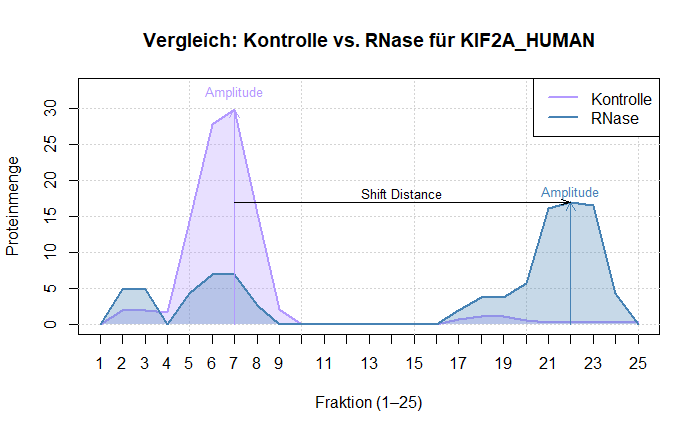
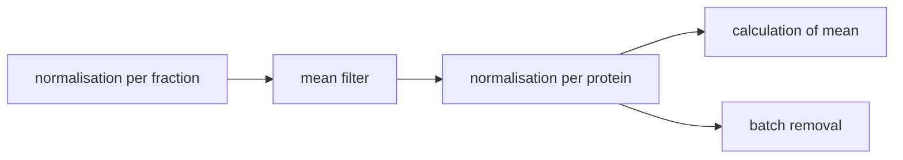
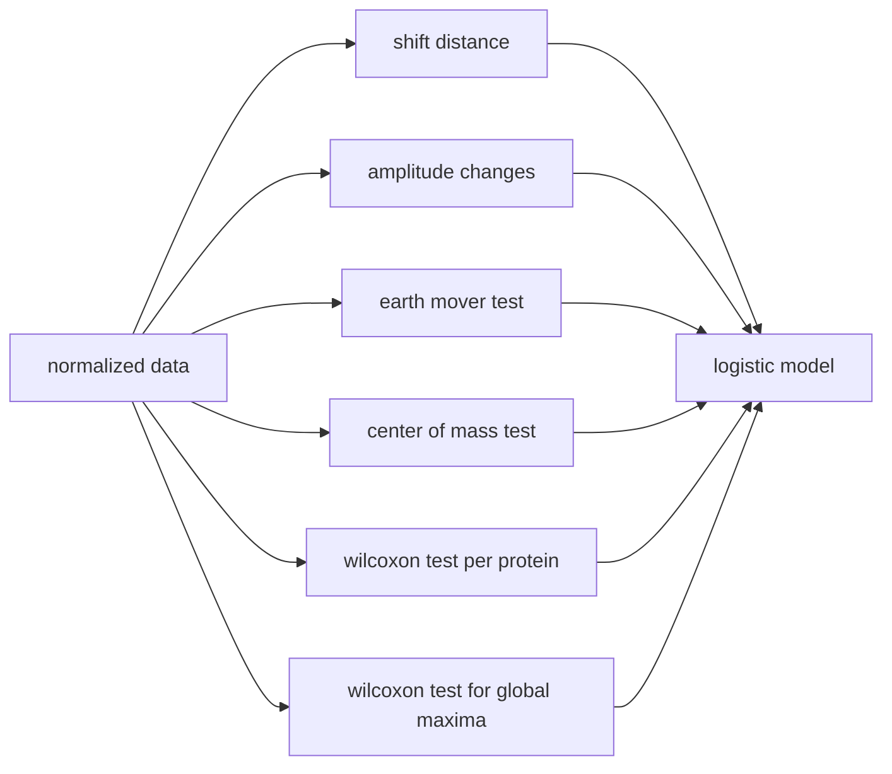
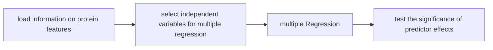

# 2025-topic-03-group-04

# 🧬 Proteome-wide Screen for RNA-dependent Proteins

Welcome to the **Proteome-wide Screen for RNA-dependent Proteins** project! This repository will
serve as the central place for exploring, analyzing, and visualizing data related to RNA-protein
interactions across the proteome.

> ⚠️ *Note: This README is a starting template. Please update it as your project evolves.*
>
> For inspiration on writing a comprehensive and engaging README, check out the [Awesome
> README](https://github.com/matiassingers/awesome-readme?tab=readme-ov-file) repository.

# 📚 Papers

# Reviews

-   [Sternburg et al., Global Approaches in Studying RNA-Binding Protein Interaction Networks, 2020,
    Trends in Biochemical
    Sciences.pdf](https://github.com/user-attachments/files/19981693/Sternburg.et.al.Global.Approaches.in.Studying.RNA-Binding.Protein.Interaction.Networks.2020.Trends.in.Biochemical.Sciences.pdf)
-   [Corley et al., How RNA-Binding Proteins Interact with RNA Molecules and Mechanisms, 2020,
    Molecular
    Cell.pdf](https://github.com/user-attachments/files/19981705/Corley.et.al.How.RNA-Binding.Proteins.Interact.with.RNA.Molecules.and.Mechanisms.2020.Molecular.Cell.pdf)
-   [Gebauer et al., RNA-binding proteins in human genetic disease, 2020, Nature Reviews
    Genetics.pdf](https://github.com/user-attachments/files/19981707/Gebauer.et.al.RNA-binding.proteins.in.human.genetic.disease.2020.Nature.Reviews.Genetics.pdf)

# Experimental methods

-   [Caudron-Herger et al., R-DeeP Proteome-wide and Quantitative Identification of RNA-Dependent
    Proteins by Density Gradient Ultracentrifugation, 2019, Molecular
    Cell.pdf](https://github.com/user-attachments/files/19981712/Caudron-Herger.et.al.R-DeeP.Proteome-wide.and.Quantitative.Identification.of.RNA-Dependent.Proteins.by.Density.Gradient.Ultracentrifugation.2019.Molecular.Cell.pdf)
-   [Caudron-Herger-Identification, quantification and bioinformatic analysis of RNA-dependent
    proteins by RNase treatment and density gradient ultracentrifugation using R-DeeP-2020-Nature
    Protocols_1.pdf](https://github.com/user-attachments/files/19981715/Caudron-Herger-Identification.quantification.and.bioinformatic.analysis.of.RNA-dependent.proteins.by.RNase.treatment.and.density.gradient.ultracentrifugation.using.R-DeeP-2020-Nature.Protocols_1.pdf)
-   [Rajagopal-Proteome-Wide Identification of RNA-Dependent Proteins in Lung Cancer
    Cells-2022-Cancers.pdf](https://github.com/user-attachments/files/19981723/Rajagopal-Proteome-Wide.Identification.of.RNA-Dependent.Proteins.in.Lung.Cancer.Cells-2022-Cancers.pdf)
-   [Rajagopal et al., An atlas of RNA-dependent proteins in cell division reveals the
    riboregulation of mitotic protein-protein interactions. Nat. Commun. 16, 2325
    (2025).pdf](https://github.com/user-attachments/files/19981728/Rajagopal.et.al.An.atlas.of.RNA-dependent.proteins.in.cell.division.reveals.the.riboregulation.of.mitotic.protein-protein.interactions.Nat.Commun.16.2325.2025.pdf)

# **Group 4 Data Analysis Projekt**

# Silent Signals: Protein Features as Predictors of RNA Interaction

RNA–protein complexes are key regulators of numerous cellular processes. In recent years,
proteome-wide experimental and computational approaches to study RNA-binding proteins (RBPs) have
gained increasing scientific relevance and attention. Recent research has revealed a link between
dysfunctional RBPs and the development of various types of cancer. These findings now open the door
to a previously underexplored area: RNA-dependent proteins — a class of proteins whose
protein–protein interactome is modulated by RNA.

## **🎯 Project Objective**

The aim of this project is the automated identification of RNA-dependent proteins in a
non-synchronized A549 cell line, which originates from a lung adenocarcinoma. To achieve this, we
investigate the influence of RNA on protein complexes by comparing protein distribution profiles
between untreated cell lysates (control samples) and RNase-treated lysates (RNase samples)

## **🧪 Experimental Design**

-   Lysates are fractionated via ultracentrifugation through a sucrose density gradient, resulting
    in 25 fractions per sample.
-   Proteins in each fraction are quantified proteome-wide using mass spectrometry, with three
    replicates per condition.
-   The final dataset consists of 3,680 proteins across 150 fractions (3,680 × 150 data points)

## **📊 Data Analysis**

-   Changes in density distribution profiles (shifts) between control and RNase-treated samples are
    analyzed.
-   These shifts form the basis for the classification of proteins based on RNA-dependence.
-   The developed tool enables automated analysis of large-scale datasets to detect RNA-modulated
    proteins using experimentally measurable features. 

# **🔮Project Overview**

## Table Of Contents

-   [Data Normalization](#data-normalisation)
    -   [Normalisation](#normalisation)
    -   [Batch Removal](#batch-removal)
-   [Shift Analysis](#shift-analysis)
    -   [Tests](#tests)
    -   [Logistic Model](#logistisches-model)
-   [Dimension Reduction](#dimension-reduction)
    -   [PCA](#pca)
    -   [k-means](#k--means)
-   [Linear Regression](#linear-regression)

## **📚Libraries:**

-   limma
-   pheatmap
-   sva
-   stringr
-   emdist
-   DT
-   tidyr
-   ggplot2
-   dplyr
-   shiny
-   cluster
-   factoextra
-   scatterplot3d
-   plotly

# **🧼Data Normalisation** {#data-normalisation}

## **🎯Objective:**

-   Vergleichbarkeit herstellen:
    -   Methoden???
-   Verzerrungen entfernen:
    -   Batch-Effekt entfernen
-   Zahlenbereiche angleichen:
    -   Skalierung und Normierung
    -   Transformation

## **📃Steps:**

### **📊Normalisation** {#normalisation}

1.  **Step 1: Normalization per Replicate and Fraction**\
    Three replicates per fraction are normalized.\
    Differences between replicates are adjusted based on the most similar replicate pair
    (normalization factor).\
    → Scaling is both fraction-specific and replicate-specific.

    **Output:**\
    Two data frames (for Control and RNase), each with 75 columns (3 × 25) containing the scaled
    protein intensities.\
    **Normed Control Dataframe (first 6 rows)**\
    

    **Normed RNase Dataframe (first 6 rows)**\
    

2.  **Step 2: Smoothing via Moving Average**\
    A moving average is applied to smooth the values.\
    → The average is calculated using the center fraction and its immediate neighbors (left and
    right).\
    → Smoothed values are computed per protein and replicate.

    **Output:**\
    Two data frames (for Control and RNase), each with 75 columns (3 × 25) containing the smoothed
    values.

3.  **Step 3: Normalization Across Replicates and Fractions per Protein**\
    Each replicate measurement is normalized individually → each replicate sums to 100%.\
    Then, for each fraction, the mean across replicates is calculated and normalized again to sum to
    100.

    **Output:**\
    Two data frames (for Control and RNase), each with 25 columns containing the final normalized
    data.\
    **Normalized Control Dataframe (first 6 rows)**\
    

    **Normalized RNase Dataframe (first 6 rows)**\
    

### **💥Batch Removal** {#batch-removal}

# **✅Shift Analysis** {#shift-analysis}

## **🎯Objective**

## ️**📃Steps**

### **📝Tests** {#tests}

### **🤖Logistic Model**

# **📈Linear Regression** {#linear-regression}

## **🎯Objective:**

-   Investigate the influence of selected predictors (molecular weight and isoelectric point) on the
    probability of RNA dependence and assess their statistical significance
-   for new data: predict RNA dependence based on experimentally accessible features

## **📃Steps**

1.  **select independent variables for multiple regression**:\
    Independent variables should exhibit minimal correlation to avoid multicollinearity\
    Therefore, the correlation between molecular weight, sequence length, and isoelectric point was
    examined\
    A strong correlation was observed between molecular weight and sequence length\
    Since molecular weight is more readily accessible experimentally than sequence length, it was
    used as a predictor in the multiple regression model along with the isoelectric point (pI).

2.  **multiple regression**:\
    The multiple regression analysis shows that both the isoelectric point (pI) and molecular weight
    (Mass_kDa) are significantly associated with the target variable (p \< 0.001). The pI has the
    stronger effect (t = 21.12), followed by molecular weight (t = 3.38) \
    This 3D scatterplot displays the actual data points alongside the regression plane determined by
    the multiple regression analysis.\
    The closer the points lie to the plane, the better the model fits the observed data. Large
    distances between the points and the plane indicate that the model explains only a small portion
    of the variance.\
    Specifically, the model explains approximately 10.8% of the variance (adjusted R² = 0.108).

3.  **test the significance of predictor effects**:\
    T-tests were conducted to determine whether RBPs and non-RBPs differ significantly in their
    isoelectric point (pI) and molecular weight\
    \
    A significant association was found between higher isoelectric point (pI) and increased
    probability of RNA dependence
